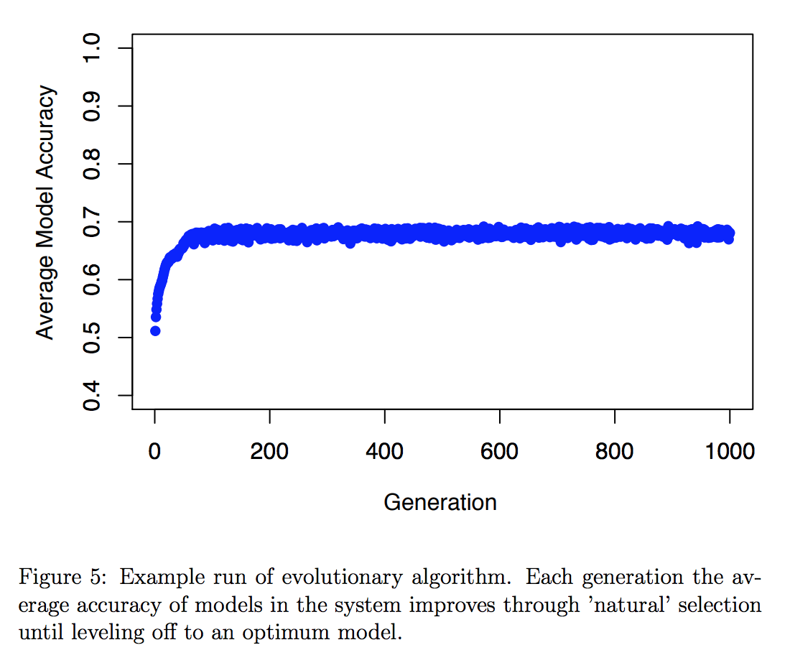

```{r setup, include=FALSE}
knitr::opts_chunk$set(echo = FALSE, cache=T)
```


<br>
<br>

<div class="column-right">
```{r, out.width = "325px"}

```
</div>
<div class="column-left">
```{r, out.width = "325px"}
knitr::include_graphics("images/Duck islands.png")
```
</div>
<div class="column-right">
```{r, out.width = "325px"}

```
</div>
<div class="column-left">
```{r, out.width = "325px"}
knitr::include_graphics("images/HB example.png")
```
</div>
<div class="column-right">
```{r, out.width = "325px"}
knitr::include_graphics("images/ordination.jpg")
```
</div>
<div class="column-left">
```{r, out.width = "325px"}
knitr::include_graphics("images/prediction example.png")
```
</div>
<div class="column-left">
```{r, out.width = "325px"}
knitr::include_graphics("images/regression.png")
```
</div>

<div>
```{r, out.width = "700px"}
knitr::include_graphics("images/soils ordination.png")
```
</div>


<!--

<div class="responsive">
  <div class="gallery">
    <a target="_blank" href="img_5terre.jpg">
{width="600"}
    </a>
    <div class="desc">Add a description of the image here</div>
  </div>
</div>


```{r, out.width = "400px"}
knitr::include_graphics("images/bayesian.png")
```
<div class="column-left">
  ```{r, out.width = "300px"}
  knitr::include_graphics("images/bayesian.png")
  ```
</div>

<br>
<br>
<br>

-->