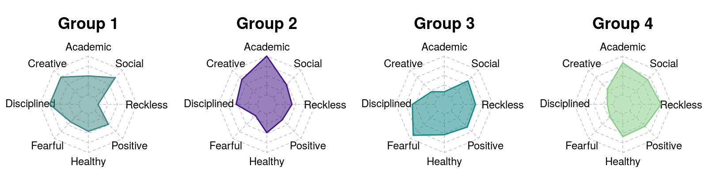

<br>
<br>
<div align="center">
</div>

```{r setup, include=FALSE, echo=F}
knitr::opts_chunk$set(echo = FALSE, cache=T)
library(ggplot2)
library(cowplot)
```


```{css, echo=FALSE}
# this adjusts the current page
body .main-container {
  max-width: 1000px !important;
  width: 1000px !important;
}
body {
  max-width: 1000px !important;
}
```

<!-- <h3>*UNDER CONSTRUCTION*</h3> -->

<!-- _________________Duck Islands Paper_____________________________ -->
<div class="row">
<div class="column-left">

</div>
<div class="column-right">
<h2>**Comparative study of the plants and soils on two islands**</h2>
</div>
</div>


<div class="row">

<div class="column-left">
<div class="luka-box">
<h3 style="margin-top:0px">_**Relevant skills**_</h3>
<div style="font-size: 15px">
| **- Ordination**
| **- Regression**
| **- Data visualization**
| **- Data collection & cleaning**
| **- Research design**
| **- Writing**
</div>
</div>
</div>

<div class="column-right">
<div class="row">
<div class="luka-box">
Here I compared the plant communities and soil features of two adjacent islands in the Gulf of Maine. I used a combination of deductive and inferential techniques combined with simple visualizations and tables that highlight how these islands differ.
[The full publication PDF is available here.](https://www.lukanegoita.com/uploads/1/3/5/3/13537361/negoita_et_al_2016b.pdf)
</div>
</div>
<div class="gal-row">
<div class="gal-col">
<a href="images/soils ordination.png">

</a>
</div>
<div class="gal-col">
<a href="images/Duck islands.png">

</a>
</div>
</div>
</div>
</div>
<hr>


<!-- ____________________Maine Island Functional Trait paper____________________________ -->
<div class="row">
<div class="column-left">

</div>
<div class="column-right" >
<br><br><br><br>
<h2>**Can plant dispersal drive ecosystem function?**</h2>
</div>
</div>

<div class="row">

<div class="column-left">
<div class="luka-box">
<h3 style="margin-top:0px">_**Relevant skills**_</h3>
<div style="font-size: 15px">
| **- Ordination**
| **- Bayesian regression**
| **- Model selection**
| **- Data visualization**
| **- Data collection & cleaning**
| **- Research design**
| **- Writing**
</div>
</div>
</div>

<div class="column-right">
<div class="row">
<div class="luka-box">
In this study I compared the variation of plant functional traits across 30 islands in the Gulf of Maine to test the potential role of plant dispersal on island ecosystems. This  was the first empirical study to show how island isolation can influence patterns of plant traits in island biogeography.

[The full publication PDF is available here.](https://www.lukanegoita.com/uploads/1/3/5/3/13537361/negoita_et_al-2016-ecography.pdf){target="_blank"}
</div>
</div>
<div class="gal-row">
<a href="images/ordination.jpg">
 
</a>
<div class="gal-col">
<a href="images/Regression.png">

</a>
</div>
<div class="gal-col">
<a href="images/bayesian.png">

</a>
</div>
</div>
</div>
</div>
<hr>


<!-- _________________Cluster analysis of Youth_____________________________ -->
<div class="row">
<div class="column-left">

</div>
<div class="column-right">
<br><br><br><br>
<h2>**Cluster analysis on human personality traits**</h2>
</div>
</div>


<div class="row">

<div class="column-left">
<div class="luka-box">
<h3 style="margin-top:0px">_**Relevant skills**_</h3>
<div style="font-size: 15px">
| **- Cluster analysis**
| **- Shiny R**
| **- Data visualization**
| **- Data cleaning**
</div>
</div>
</div>

<div class="column-right">
<div class="row">
<div class="luka-box">
In 2013, students of the Statistics class at FSEV UK were asked to invite their friends to participate in this survey. The survey consisted of questions related to everything from fears, to hobbies, spending habits, and personality traits. After removing missing values, a k-means cluster analysis was conducted to identify major groupings of youth.
[Interactive results are available as a simple Shiny app.](https://lukanegoita.shinyapps.io/young_archetypes_of_slovakia/)
</div>
</div>
<div class="gal-row">
<a href="images/personality_clusters.png">
 
</a>
</div>

<div class="gal-row">
<div class="gal-col">
<a href="images/Regression.png">

</a>
</div>
<div class="gal-col">
<a href="images/Regression.png">

</a>
</div>
</div>
</div>
</div>
<hr>


<!-- _________________Stock market prediction_____________________________ -->
<div class="row">
<div class="column-left">

</div>
<div class="column-right">
<br><br><br>
<h2>**Stock market trading using a genetic algorithm (and other models)**</h2>
</div>
</div>


<div class="row">

<div class="column-left">
<div class="luka-box">
<h3 style="margin-top:0px">_**Relevant skills**_</h3>
<div style="font-size: 15px">
| **- Evolutionary algorithms**
| **- Logistic regression**
| **- Bayesian inference**
| **- Time-series analysis**
| **- Data cleaning**
</div>
</div>
</div>

<div class="column-right">
<div class="row">
<div class="luka-box">
I used a combination of cross-correlation, linear and logistic regression, and Bayesian approaches, along with a genetic algorithm for optimizing a successeful stock prediction algorithm.
</div>
</div>
<div class="gal-row">
<a href="images/personality_clusters.png">
 
</a>

</div>
</div>
</div>
<hr>


<div class="center">
[.](markdown_pres_template.html)
</div>