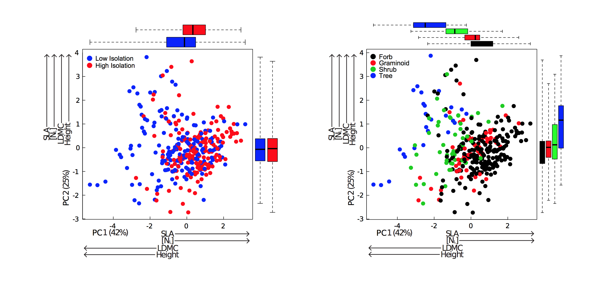

```{r setup, include=FALSE}
knitr::opts_chunk$set(echo = FALSE, cache=T)
```


<!--

<br>

<div class="column-right">
```{r, out.width = "325px"}
knitr::include_graphics("images/Clarks Hill Ordination.png")
```
</div>
<div class="column-left">
```{r, out.width = "325px"}

```
</div>
<div class="column-right">
```{r, out.width = "325px"}
knitr::include_graphics("images/evo algorithm.png")
```
</div>
<div class="column-left">
```{r, out.width = "325px"}

```
</div>
<div class="column-right">
```{r, out.width = "325px"}

```
</div>
<div class="column-left">
```{r, out.width = "325px"}

```
</div>
<div class="column-left">
```{r, out.width = "325px"}
knitr::include_graphics("images/regression.png")
```
</div>

<div>
```{r, out.width = "700px"}

```
</div>


-->