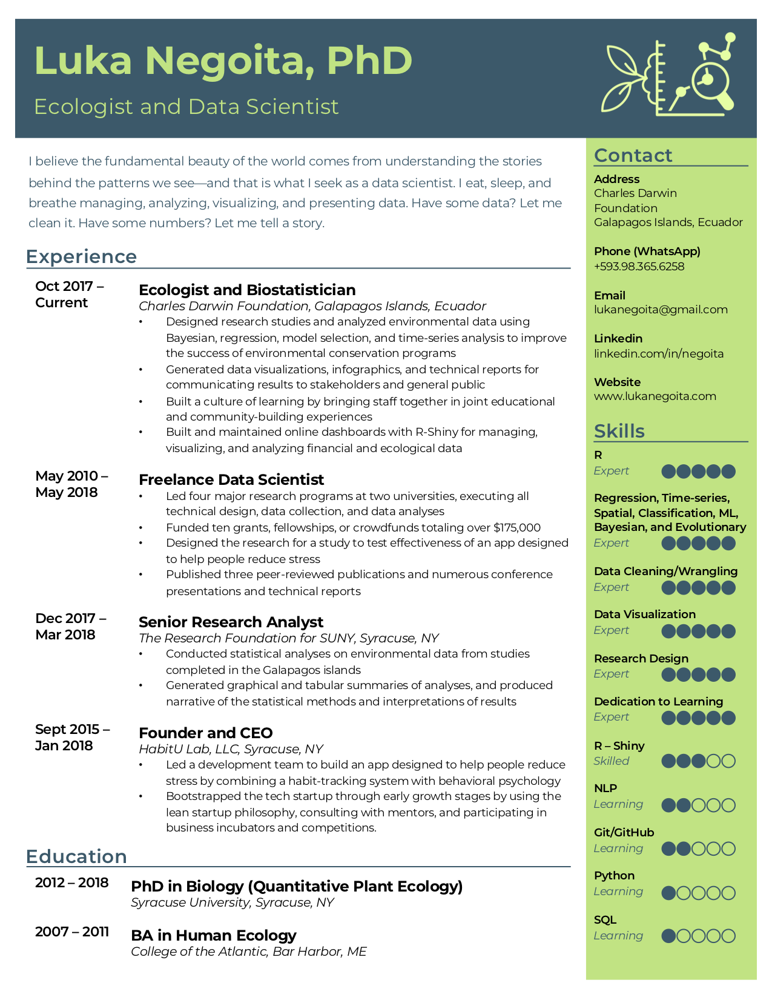

```{r setup, include=FALSE, echo=F}
knitr::opts_chunk$set(echo = FALSE, cache=T)
```


```{css, echo=FALSE}
# this adjusts the current page
body .main-container {
  max-width: 1000px !important;
  width: 1000px !important;
}
body {
  max-width: 1000px !important;
}

a:hover img {
  opacity: 1;
  filter: alpha(opacity=100);
}
```

<br>
<h3 style="text-align:center">*Last Updated: Oct 12, 2019*</h3>
<h3 style="text-align:center">**Click below to download**</h3>


<a href="resumes/resume_10_12_19.pdf" target="_blank">
 
</a>